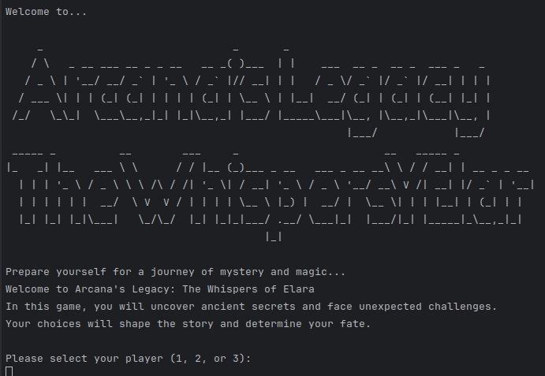

# Arcana's Legacy: The Whispers of Elara

## Description

"Arcana's Legacy: The Whispers of Elara" is an interactive text-based adventure game where players uncover ancient secrets and face unexpected challenges. Set in a world of mystery and magic, this game offers a unique experience where your choices shape the story and determine your fate.

## Features

- Multiple character choices: Play as Arcana, Aegis, or Gladius
- Branching storylines based on player decisions
- Rich, immersive narrative with elements of mystery and magic
- Simple, text-based interface for easy gameplay

## Installation

1. Ensure you have Rust installed on your system. If not, you can download it from [rust-lang.org](https://www.rust-lang.org/).

2. Clone this repository:
   ```
   git clone https://github.com/vastsea0/arcanas-legacy.git
   ```

3. Navigate to the project directory:
   ```
   cd arcanas-legacy
   ```

4. Build the project:
   ```
   cargo build --release
   ```

5. Run the game:
   ```
   cargo run --release
   ```

## How to Play

1. Start the game and choose your character.
2. Read the narrative carefully and make choices when prompted.
3. Your decisions will influence the story and lead to different outcomes.
4. Enjoy the adventure and uncover the mysteries of Elara!

## Contributing

We welcome contributions to Arcana's Legacy! If you have suggestions for improvements or bug fixes, please open an issue or submit a pull request.

## License

This project is licensed under the MIT License - see the [LICENSE](LICENSE) file for details.

## Acknowledgments

- Thanks to all the beta testers who provided valuable feedback.
- Special thanks to the Rust community for their excellent documentation and tools.

## Contact

For any queries or feedback, please contact us at [vastseaoffical0@outlook.com](mailto:vastseaoffical0@outlook.com).

Enjoy your journey through the magical world of Arcana's Legacy!